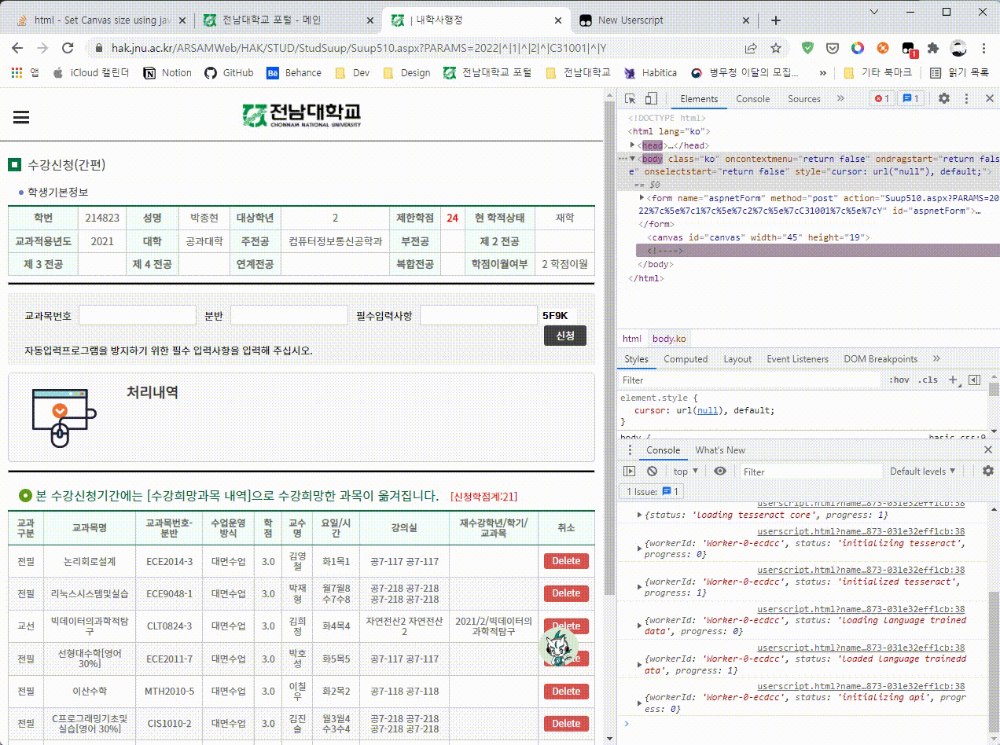

# Captcha Unlocker

전남대학교 수강신청 페이지의 매크로 방지 캡챠를 자동으로 입력해주는 유저스크립트입니다.

이 유저스크립트는 [Tesseract.js](https://tesseract.projectnaptha.com/)를 활용하므로 테서렉트의 성능에 따라 정확한 값을 입력하지 못할 수 있습니다.

* `=` 키를 입력하면 캡챠 이미지를 다시 불러옵니다.
  * 오류가 있어 캡챠 이미지를 제대로 불러오지 못한 경우에 활용할 수 있습니다.
* `-` 키를 입력하면 결과값 입력란을 비웁니다.
  * 잘못된 결과를 반환할 경우 입력란을 빠르게 비울 수 있습니다.

## 시작하기

### 유저스크립트 익스텐션 설치
[Tampermonkey](https://chrome.google.com/webstore/detail/tampermonkey/dhdgffkkebhmkfjojejmpbldmpobfkfo?hl=ko)와 같은 유저스크립트 익스텐션을 설치합니다.

### 유저스크립트 설치
[유저스크립트 설치 링크](https://raw.githack.com/ShapeLayer/lecture-enrolling-tools/main/captchaUnlocker.user.js/captchaUnlocker.user.js)로 접속합니다.

설치되는 유저스크립트는 본 저장소의 `captchaUnlocker.user.js`와 동일합니다.